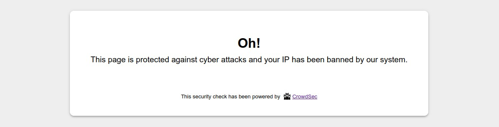

# CrowdSec standalone PHP bouncer

## User Guide


<!-- START doctoc generated TOC please keep comment here to allow auto update -->
<!-- DON'T EDIT THIS SECTION, INSTEAD RE-RUN doctoc TO UPDATE -->
**Table of Contents**

- [Description](#description)
- [Features](#features)
- [Usage](#usage)
- [Configurations](#configurations)
  - [Bouncer behavior](#bouncer-behavior)
  - [Local API Connection](#local-api-connection)
  - [Cache](#cache)
  - [Geolocation](#geolocation)
  - [Captcha and ban wall settings](#captcha-and-ban-wall-settings)
  - [Debug](#debug)
  - [Security note](#security-note)

<!-- END doctoc generated TOC please keep comment here to allow auto update -->


## Description

This project provides a CrowdSec "standalone" bouncer for PHP-based websites. It is intended to be used with [an `auto_prepend_file` directive.](https://www.php.net/manual/en/ini.core.php#ini.auto-prepend-file)

## Features

- CrowdSec Local API Support
  - Handle `ip`, `range` and `country` scoped decisions
  - `Live mode` or `Stream mode`
  - API key or TLS authentication
  - AppSec remediation support (only with API key authentication)
- Support IpV4 and Ipv6 (Ipv6 range decisions are yet only supported in `Live mode`) 
- Large PHP matrix compatibility: 7.2, 7.3, 7.4, 8.0, 8.1, 8.2 and 8.3
- Built-in support for the most known cache systems Redis, Memcached and PhpFiles
  - Clear, prune and refresh the bouncer cache

- Cap remediation level (ex: for sensitives websites: ban will be capped to captcha)


## Usage

When a user is suspected by CrowdSec to be malevolent, the bouncer would either display a captcha to resolve or
simply a page notifying that access is denied. If the user is considered as a clean user, he/she will access the page 
as normal.

A ban wall could look like:



A captcha wall could look like:


With the provided standalone bouncer, it is possible to customize all the colors of these pages so that they integrate best with your design.

On the other hand, all texts are also fully customizable. This will allow you, for example, to present translated pages in your users' language.

## Configurations

Here is the list of available settings that you could define in the `scripts/settings.php` file:

### Bouncer behavior

- `bouncing_level`:  Select from `bouncing_disabled`, `normal_bouncing` or `flex_bouncing`. Choose if you want to apply CrowdSec directives (Normal bouncing) or be more permissive (Flex bouncing). With the `Flex mode`, it is impossible to accidentally block access to your site to people who don’t deserve it. This mode makes it possible to never ban an IP but only to offer a captcha, in the worst-case scenario.


- `fallback_remediation`: Select from `bypass` (minimum remediation), `captcha` or `ban` (maximum remediation). Default to 'captcha'. Handle unknown remediations as.

- `appsec_fallback_remediation`: Select from `bypass` (minimum remediation), `captcha` (recommended) or `ban` (maximum remediation). 
  Default to 'captcha'. Will be used as remediation in case of AppSec failure (timeout). 


- `trust_ip_forward_array`:  If you use a CDN, a reverse proxy or a load balancer, set an array of IPs. For other IPs, the bouncer will not trust the X-Forwarded-For header.


- `excluded_uris`: array of URIs that will not be bounced.


- `stream_mode`: true to enable stream mode, false to enable the live mode. Default to false. By default, the `live mode` is enabled. The first time a user connects to your website, this mode means that the IP will be checked directly by the CrowdSec API. The rest of your user’s browsing will be even more transparent thanks to the fully customizable cache system. But you can also activate the `stream mode`. This mode allows you to constantly feed the bouncer with the malicious IP list via a background task (CRON), making it to be even faster when checking the IP of your visitors. Besides, if your site has a lot of unique visitors at the same time, this will not influence the traffic to the API of your CrowdSec instance.

- `use_appsec`: true to enable AppSec remediation. Default to false. If you enable this setting, you need to define the `appsec_url` setting below. If true, and if the initial Lapi remediation is a `bypass`, a remediation based on the current request will be retrieved from the AppSec endpoint and will be used as final remediation. This feature is only available if you use `api_key` as `auth_type`.

### Local API Connection

- `auth_type`: Select from `api_key` and `tls`. Choose if you want to use an API-KEY or a TLS (pki) authentification.
  TLS authentication is only available if you use CrowdSec agent with a version superior to 1.4.0.


- `api_key`: Key generated by the cscli (CrowdSec cli) command like `cscli bouncers add standlone-php-bouncer`.
  Only required if you choose `api_key` as `auth_type`.


- `tls_cert_path`: absolute path to the bouncer certificate (e.g. pem file).
  Only required if you choose `tls` as `auth_type`.
  **Make sure this path is not publicly accessible.** [See security note below](#security-note).


- `tls_key_path`: Absolute path to the bouncer key (e.g. pem file).
  Only required if you choose `tls` as `auth_type`.
  **Make sure this path is not publicly accessible.** [See security note below](#security-note).


- `tls_verify_peer`: This option determines whether request handler verifies the authenticity of the peer's certificate.
  Only required if you choose `tls` as `auth_type`.
  When negotiating a TLS or SSL connection, the server sends a certificate indicating its identity.
  If `tls_verify_peer` is set to true, request handler verifies whether the certificate is authentic.
  This trust is based on a chain of digital signatures,
  rooted in certification authority (CA) certificates you supply using the `tls_ca_cert_path` setting below.


- `tls_ca_cert_path`: Absolute path to the CA used to process peer verification.
  Only required if you choose `tls` as `auth_type` and `tls_verify_peer` is set to true.
  **Make sure this path is not publicly accessible.** [See security note below](#security-note).


- `api_url`: Define the URL to your Local API server, default to `http://localhost:8080`.

- `appsec_url`: Define the URL to your AppSec server, default to `http://localhost:7422`. Only needed if you use AppSec remediation (see `use_appsec` setting above).

- `api_timeout`: In seconds. The global timeout when calling Local API. Default to 120 sec. If set to a negative value
  or 0, timeout will be unlimited.


- `api_connect_timeout`: In seconds. **Only for curl**. The timeout for the connection phase when calling Local 
  API. Default to 300 sec. If set to a 0, timeout will be unlimited.

- `appsec_timeout_ms`: In milliseconds. The global timeout when calling AppSec. Default to 400 ms. If set to a negative value or 0, timeout will be unlimited.

- `appsec_connect_timeout_ms`: In milliseconds. **Only for curl**. The timeout for the connection phase when calling AppSec. Default to 150 ms. If set to a 0, timeout will be unlimited.


- `use_curl`: By default, this lib call the REST Local API using `file_get_contents` method (`allow_url_fopen` is required).
  You can set `use_curl` to `true` in order to use `cURL` request instead (`ext-curl` is in then required)

### Cache

- `cache_system`: Select from `phpfs` (PHP file cache), `redis` or `memcached`.


- `fs_cache_path`: Will be used only if you choose PHP file cache as `cache_system`.
  **Make sure this path is not publicly accessible.** [See security note below](#security-note).


- `redis_dsn`:   Will be used only if you choose Redis cache as `cache_system`.


- `memcached_dsn`: Will be used only if you choose Memcached as `cache_system`.


- `clean_ip_cache_duration`: Set the duration we keep in cache the fact that an IP is clean. In seconds. Defaults to 5.


- `bad_ip_cache_duration`: Set the duration we keep in cache the fact that an IP is bad. In seconds. Defaults to 20.


- `captcha_cache_duration`: Set the duration we keep in cache the captcha flow variables for an IP. In seconds.
  Defaults to 86400.. In seconds. Defaults to 20.


### Geolocation

- `geolocation`: Settings for geolocation remediation (i.e. country based remediation).

    - `geolocation[enabled]`: true to enable remediation based on country. Default to false.

    - `geolocation[type]`:  Geolocation system. Only 'maxmind' is available for the moment. Default to `maxmind`.

    - `geolocation[cache_duration]`: This setting will be used to set the lifetime (in seconds) of a cached country
      associated to an IP. The purpose is to avoid multiple call to the geolocation system (e.g. maxmind database). Default to 86400. Set 0 to disable caching.

    - `geolocation[maxmind]`: MaxMind settings.

    - `geolocation[maxmind][database_type]`: Select from `country` or `city`. Default to `country`. These are the two available MaxMind database types.

    - `geolocation[maxmind][database_path]`: Absolute path to the MaxMind database (e.g. mmdb file)
      **Make sure this path is not publicly accessible.** [See security note below](#security-note).


### Captcha and ban wall settings


- `hide_mentions`: true to hide CrowdSec mentions on ban and captcha walls.


- `custom_css`: Custom css directives for ban and captcha walls


- `color`: Array of settings for ban and captcha walls colors.

    - `color[text][primary]`

    - `color[text][secondary]`

    - `color[text][button]`

    - `color[text][error_message]`

    - `color[background][page]`

    - `color[background][container]`

    - `color[background][button]`

    - `color[background][button_hover]`


- `text`: Array of settings for ban and captcha walls texts.

    - `text[captcha_wall][tab_title]`

    - `text[captcha_wall][title]`

    - `text[captcha_wall][subtitle]`

    - `text[captcha_wall][refresh_image_link]`

    - `text[captcha_wall][captcha_placeholder]`

    - `text[captcha_wall][send_button]`

    - `text[captcha_wall][error_message]`

    - `text[captcha_wall][footer]`

    - `text[ban_wall][tab_title]`

    - `text[ban_wall][title]`

    - `text[ban_wall][subtitle]`

    - `text[ban_wall][footer]`


### Debug
- `debug_mode`: `true` to enable verbose debug log. Default to `false`.


- `disable_prod_log`: `true` to disable prod log. Default to `false`.


- `log_directory_path`: Absolute path to store log files.
  **Make sure this path is not publicly accessible.** [See security note below](#security-note).


- `display_errors`: true to stop the process and display errors on browser if any.


- `forced_test_ip`: Only for test or debug purpose. Default to empty. If not empty, it will be used instead of the
  real remote ip.


- `forced_test_forwarded_ip`: Only for test or debug purpose. Default to empty. If not empty, it will be used
  instead of the real forwarded ip. If set to `no_forward`, the x-forwarded-for mechanism will not be used at all.

### Security note

Some files should not be publicly accessible because they may contain sensitive data:

- Setting file `settings.php`
- Log files
- Cache files of the File system cache
- TLS authentication files
- Geolocation database files

If you define publicly accessible folders in the settings, be sure to add rules to deny access to these files.

In the following example, we will suppose that you use a folder `crowdsec` with sub-folders `logs`, `cache`, `tls` and `geolocation`.

If you are using Nginx, you could use the following snippet to modify your website configuration file:

```nginx
server {
   ...
   ...
   ...
   # Deny all attempts to access some folders of the crowdsec standalone bouncer
   location ~ /crowdsec/(settings|logs|cache|tls|geolocation) {
           deny all;
   }
   ...
   ...
}
```

If you are using Apache, you could add this kind of directive in a `.htaccess` file:

```htaccess
Redirectmatch 403 crowdsec/settings
Redirectmatch 403 crowdsec/logs/
Redirectmatch 403 crowdsec/cache/
Redirectmatch 403 crowdsec/tls/
Redirectmatch 403 crowdsec/geolocation/
```

**N.B.:**
- There is no need to protect the `cache` folder if you are using Redis or Memcached cache systems.
- There is no need to protect the `logs` folder if you disable debug and prod logging.
- There is no need to protect the `tls` folder if you use Bouncer API key authentication type.
- There is no need to protect the `geolocation` folder if you don't use the geolocation feature.
